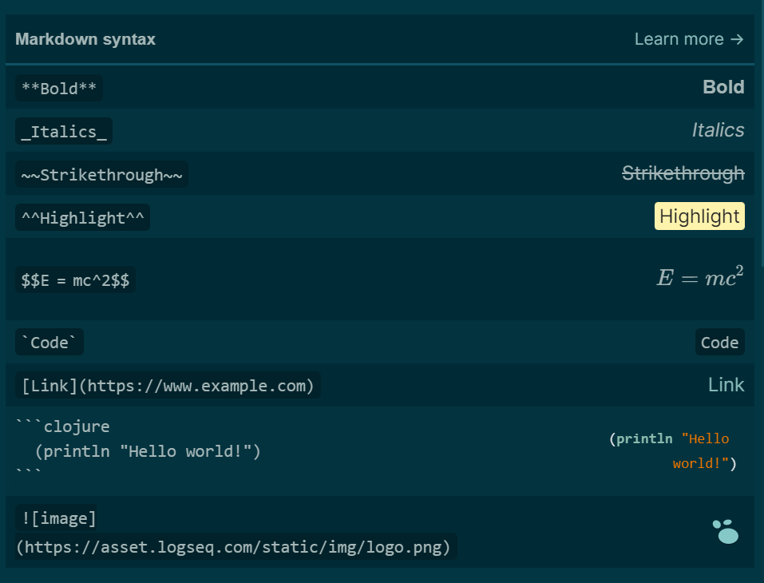

- # DONE 行研测试小组 logseq 介绍
  :LOGBOOK:
  CLOCK: [2023-07-17 Mon 20:17:38]
  CLOCK: [2023-07-17 Mon 20:17:43]--[2023-07-17 Mon 20:17:43] =>  00:00:00
  CLOCK: [2023-07-17 Mon 20:17:43]--[2023-07-17 Mon 20:32:50] =>  00:15:07
  :END:
	- 下载链接： https://github.com/logseq/logseq
		- https://github.com/logseq/logseq/releases
	- ## Markdown
	  id:: 64b52ecc-9298-462c-9c9c-ce88d95f5042
	  collapsed:: true
		- 文件的分类
			- 文本型 ✔
			  id:: 64b52f0e-54e6-4a49-aa76-524b8aae4b26
			- 二进制文件
			  id:: 64b52f11-97a4-497b-8c42-db7cbb520447
		- 标记型语言
			- LaTeX
				- $$
				  xx \\
				   \bold{xx}
				  $$
				  ```LATEX
				  $$
				  xx \\
				   \bold{xx}
				  $$
				  ```
			- HTML
				- 标识加粗： <b>加粗</b> 
				  ```HTML
				  <b>加粗</b>
				  ```
		- 如果想标记格式
			- word ((64b52f11-97a4-497b-8c42-db7cbb520447))
				- 富文本，额外的标记
			- ((64b52ecc-9298-462c-9c9c-ce88d95f5042)) ((64b52f0e-54e6-4a49-aa76-524b8aae4b26))
				- 
				- ==高亮==
				- **加粗**
		- 大纲 = 树 = 无序列表
			- ```
			  顶级标题
			  - 子1
			  - 子2
			  ```
		-
	- ## logseq 库文件夹都有什么
		- .github
			- >无须过多在意，非必须
			- git 同步相关
			- 可能会有 action 相关
		- .gitattributes
			- git 相关
		- assets
			- 图片、拖进来的PDF、PDF的高亮...
		- journals
			- 日志
			- 信息的入口
		- pages
			- 非 journals 页面
		- logseq
			- 配置相关
			- bak
				- 自动备份，丢了内容可以在这里找
			- .recycle
				- 回收站
			- config.edn
				- 库的配置
			- custom.css
				- 样式设置
	- git 同步相关
		- 1G 随便用
		- 10G 会给警告
		- 100G 封号
		- >后续官方同步
	- ## 如何使用 logseq 阅读 PDF
		- ### Step1 拖拽进来（非最优解，但省事儿）
			- 
			- [Zotero多端同步](https://logseq.pro/#/page/zotero%E5%A4%9A%E7%AB%AF%E5%90%8C%E6%AD%A5) => 个人向更好的文件管理策略
		- ### Step2 阅读
			- 划线高亮
				- ((64b532ef-83ad-40ff-96d1-e185b7240d08)) #碳排放
				- ((64b5331c-d31e-41fc-bcac-84ced7e51d74)) #协议 #组织
				  id:: 64b5331f-a350-438e-82e5-42bad9b3df12
					- `((64b5331c-d31e-41fc-bcac-84ced7e51d74))` => block's uuid
			- 区域高亮
				- ((64b5336b-1524-4fb5-a0aa-72e37b744918))
				  id:: 64b532d0-cd2a-4954-a923-982a58708128
				  #组织
		- 参考内容：
			- ((649b1a30-7c22-43e7-8940-483b77a3a3b9))
	- ### 如何使用 白板 组织信息
		- [[测试政策]]