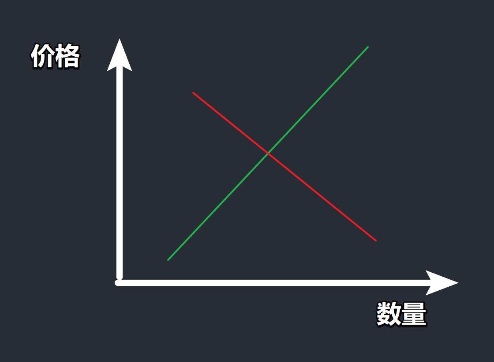
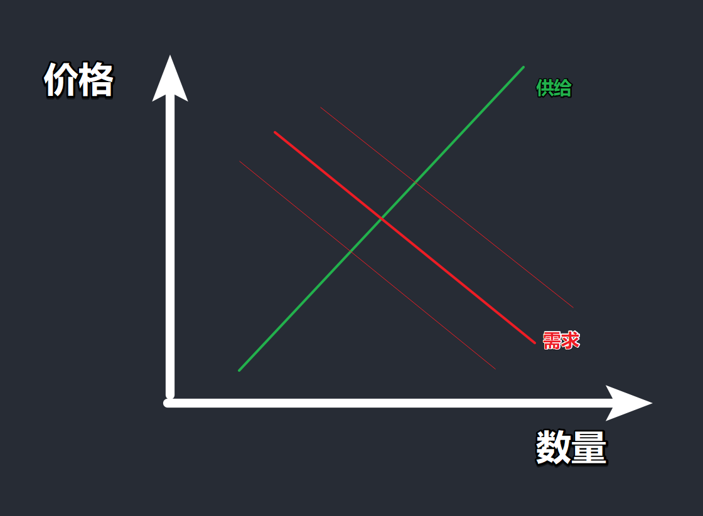

# 从源头理解国家战略的本质及掌握经济周期的实践工具 @张奥平 #政策
	- ## INTRO
		- 结论x 工具√
		- 把国家当作公司 => 战略 / 政策
	- ## PART1 战略
	  {{embed ((6502efeb-4a80-49a4-99a9-c305e0b9c887))}}
		- ### 高质量发展
			- 中心任务：全面建成社会主义现代化**强国**
			- 首要任务：高质量发展
		- ### [[工具]]1：研究关键词
			- 找到该关键词第一次出现的场景
				- 诞生一瞬间背景
				- 高质量发展什么时候第一次出现？ => 十九大报告
		- 经济增速换挡：从告诉增长到高质量发展的必然
			- 历史！周期！ => 3%
		- ### 发展阶段
			- >《国家竞争优势》：要素驱动、投资驱动、创新驱动、财富驱动
			- 改革开放至今
				- 人力成本+土地成本
				- 城镇化率：修铁路、修桥、修机场
			- 创新驱动：对内跨越“中等收入陷阱”的必然选择
				- 门槛：1.3万美金
					- 世界银行关于高等收入国家的线
					- 中等收入陷阱
			- 刘鹤（前副总理、中央财经委员会办公室主任）
		- ### 同一起点的发展图！
			- >1972年（跨越中等收入陷阱）美国在干什么？
			- 美国科技一体两翼
				- 硅谷（资产端）
				- 纳斯达克（资金端）
			- 微软（1975-1980上市）、苹果（1976-1982上市）
			- >当今的中国
			- 科技一体两翼
				- 科技创新、专精特新（产业）
				- 科创板、北交所（资本）
			- 供给侧：索罗经济增长模型——新古典经济增长模型
				- >（假定需求无限）
				- $$
				  Y = A\cdot F(K,L)
				  $$
				- Y：潜在产出（国名财富）
				- A：全要素生产率（知识、技术）
				- F：劳动与资本的组织方式（制度）
				- K：资本
				- L：劳动
			- 凯恩斯——有效需求很重要！
		- ### 核心技术与经济发展的范式：科技指数型增长
			- 通用技术
				- 带来整个市场效率的大幅提升
				- 1972：汽车、飞机、电脑...
				- 今天：信息、新能源...
			- 21世纪通用技术（GPT）：信息技术、能源技术商业机遇
		- ### [[工具]]2：政策
			- 2021年发生的事情 => 写进了 2015 年年底的中央经济工作会议
			- 去年年底关键词
				- 完善**新型举国体制**
		- ### 举国体制
			- >历史脉络：从竞技体育到科技创新
			- 举国体制（2002）
			- 新型举国体制（2011）
			- =>关键核心技术（2022）
		- ### 二十大报告：聚焦16个重点行业方向
			- >四个面向
		- 新质生产力：新兴产业+未来产业
	- ## Break
		- 课余：获取新知识信息
	- ## PART2
		- 关于十九大 vs 二十大
			- 十九大：供给侧
			- 二十大：**扩大内需**
		- ### 居民消费率
			- >中国长期消费不足、储蓄过剩
			- 产出=收入=消费+储蓄
				- 产出↑ 收入↑ 消费↓ 储蓄↑↑
			- 中国最大的结构性问题
				- **消费不足，储蓄过剩**
		- ### "中国生产——美国消费"的国家大循环
			- GDP = 消费+投资+出口
				- 经济的三驾马车
			- 出口 = 产出-（消费+投资）
			- 经常项目顺差 = 储蓄-投资（内部）
			- 原料 => 中国 work => 美国 enjoy
		- ### 日本的前车之鉴——广场协议
			- 日元升值 => 不消费！
				- 日本放水 => 利率0 => 股市/房市 => 提高利率(2.5%)
			- 资产负债表——泡沫破裂
				- 房子贬值，但负债刚性 => 十年还债
		- ### [[工具]]3：看政策文件要排序
			- 靠前的段落、句子、文字 => 支持力度更大！
		- ### 扩大内需“BP”——《扩大内需战略规划纲要（2022-2035）》
		- ### 事实出发：从价格和交易量推断市场瓶颈是供给还是需求
			- 凯恩斯：大萧条
				- 需求侧
			- 卢卡斯：大滞涨
				- 供给侧
			- #kanban
				- |||
				  |{:height 151, :width 347}|{:height 275, :width 363}|
		- ### 企业和居民部门是割裂的！
			- 国企/央企 => 保证稳定发展
			- 民企 => 破上限
			- 居民投资
			- >《中国经济制度》张五常
		- ### [[工具]]4：一中全会到七中全会的核心词
			- 三中全会：经济改革
				- 每逢双数届——大变革！
			- 十九届三中全会——提到**数据**
				- 今年看看有没有数据相关
			- 中国
			-
	-
	- ###