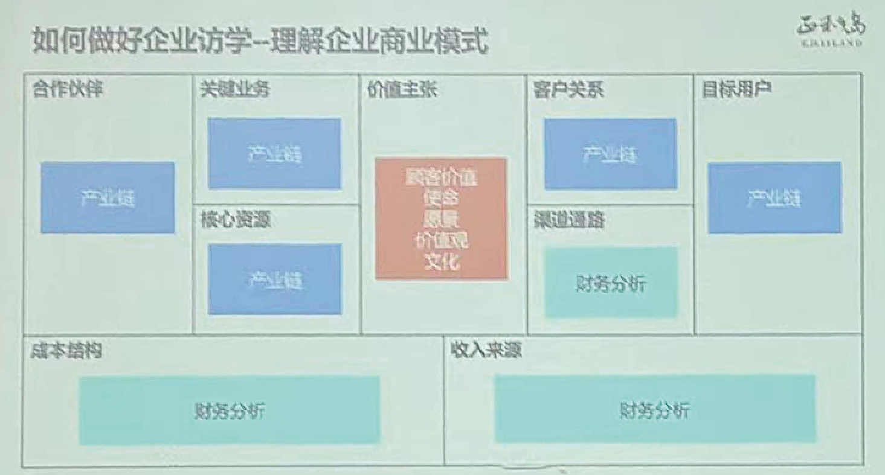

# 如何做企业现场考察 @[[史船]]
	- ## 设定明确目标
		- >提问1：你参加企业访学的目标是什么？
		- > **查看问听思**
	- ## **查**询企业基本信息
		- ### 查什么？
			- 产业链+商业模式
		- ### 理解企业[[商业模式]]
			- >上市公司的年报+招股说明书
			- 作业一：画参访企业的商业画布
			- 
			  #产业链 #财务分析
	- ## **看**
		- ### 制造业的分类
			- 流程制造
				- 原料、能源价格
				- 水泥、钢铁、化工
			- 离散制造
				- 供应链管理
		- ### 企业文化——“企业文化”
			- >提问：为什么友发之歌？
			- >华为出征视频
			- 创新 - 自由
		- ### 再谈领导力
			- 企业一把手
				- 讲得多不是好领导！
				- 听不到员工的声音
			- [[Ws]]: 区分合伙人和员工？
			- 背猴子 vs. 责任
		- ### 精益管理
			- 放水杯
			- 防呆防错放浪费
			- [[Ws]]: 联想到特斯拉的生产地狱
			- 制造企业 -> 效率第一位！
				- 人与机器的关系
		- ### 参观工厂小结
	- # 问
		- >多多提问
		- ### 心理学——教学欲望/好为人师
			- 联想到富兰克林效应
			- 优质的提问 ->
		- ### 公开提问环节——提问的标准
			- 私人性？ —— 其他人是否感兴趣？
			- 是否有价值
	- # 听
		- >场景创新
		- ### 货车司机
			- 东鹏特饮->防尘盖？烟灰缸？
			- 脉动->方便方便
		- ### 社会责任（ESG）
			- 好利来 -> 路灯
			- 奔驰 -> 运动场/设施
	- # 思
		- ### 智力三元论
			- 分析
			- 适应
			- 创造
	- # 补充
		- ### [[任晓麟]]
			- 专注
			- 多读书
			- 偏执——《新工业时代》
				- ### 是否一定要有学历才能做好事情？
					- 做好事情最重要