- #+BEGIN_CENTER
  >**行研入门索引**
  #+END_CENTER
- ## 行研扫盲
	- ### [如何快速了解一个行业 - 麦肯锡教我的研究方法](https://www.bilibili.com/video/BV1t3411W7Ad/) #产业链 #波特五力
	- <iframe frameborder="no" framespacing="0" width="560" src="https://player.bilibili.com/player.html?bvid=BV1t3411W7Ad&high_quality=1&autoplay=0" allow="accelerometer; clipboard-write; encrypted-media; gyroscope" allowfullscreen="" scrolling="no" border="0" height="360"></iframe>
- ## 企业
	- ### [[波特五力]]
		- >波特五力（Porter's Five Forces）是由美国学者迈克尔·波特（Michael Porter）于1979年提出的战略分析框架，用于评估一个行业的竞争环境和吸引力。这个框架将一个行业的竞争力量分为五个主要方面，帮助企业了解在特定市场中竞争的潜在威胁和机会。
		- 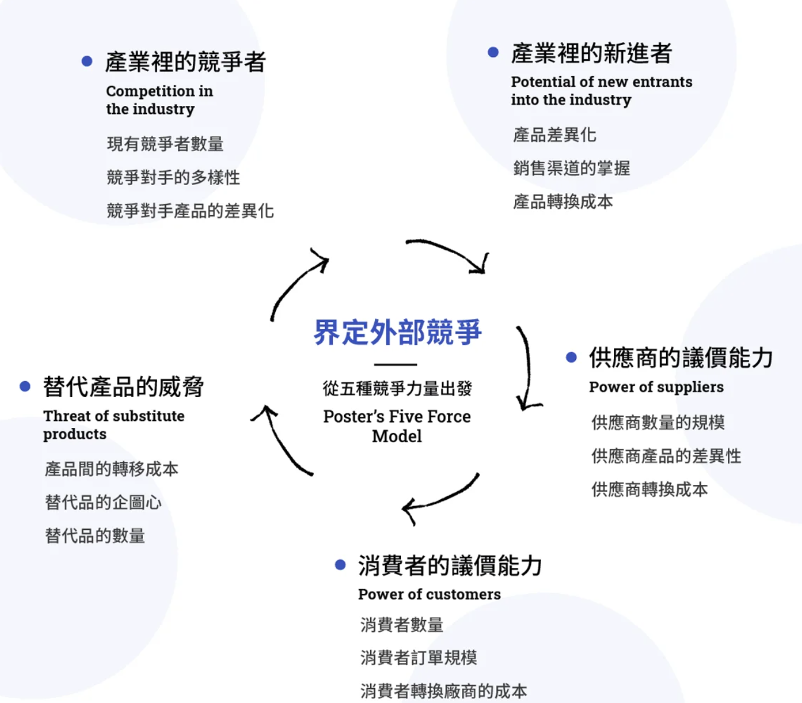
		- **竞争对手的威胁**
		  *Threat of New Entrants*
			- 如果进入门槛低，新竞争者容易进入市场，那么行业的竞争程度可能会增加，对现有竞争者构成威胁。
		- **供应商的议价能力**
		  *Bargaining Power of Suppliers*
			- 如果供应商较少且提供特定资源或服务，他们可能能够施加更多的价格压力，从而减少企业的利润。
		- **买家的议价能力**
		  *Bargaining Power of Buyers*
			- 如果买家众多且购买量大，他们可能能够要求更低的价格或更好的条件，降低企业的利润率。
		- **替代品或替代服务的威胁**
		  *Threat of Substitutes*
			- 如果存在具有类似功能的替代品，消费者可能会转向这些替代品，从而影响行业的吸引力。
		- **现有竞争者之间的竞争程度**
		  *Intensity of Competitive Rivalry*
			- 竞争激烈的行业可能会导致价格战和利润率下降，对企业造成压力。
		- 推荐阅读
			- [五力分析這樣做！掌握市場趨勢，制定精準銷售策略 | Apple、台積電五力分析範例 | 波特五力](https://www.hububble.co/blog/porters-five-forces)
	- ### [[商业模式]]
	  collapsed:: true
		- 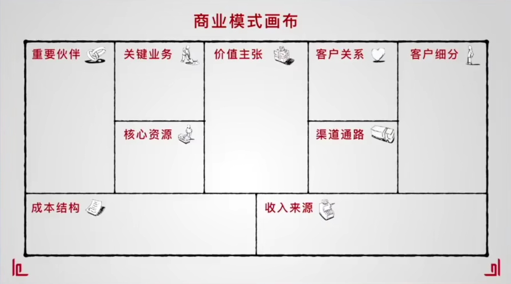
		- <iframe frameborder="no" framespacing="0" width="560" src="https://player.bilibili.com/player.html?bvid=BV1xG411t7R3&high_quality=1&autoplay=0" allow="accelerometer; clipboard-write; encrypted-media; gyroscope" allowfullscreen="" scrolling="no" border="0" height="360"></iframe>
- ## [[财务报表]]
	- >本节简要介绍最重要三个报表
	- ### 损益表/利润表（Income Statement）
		- >损益表的主要目的是提供一个清晰的财务快照，以便利益相关者（如股东、投资者、管理层、债权人和审计师）了解企业在报告期内的经营情况和盈利能力。它还可以用于比较不同时间段内的业绩，分析成本和支出的趋势，以及制定战略决策，例如确定营销策略、降低成本或改进利润率。
		- 总收入（Total Revenue）
		- 成本与费用（Costs and Expenses）
		- 成本商品销售（Cost of Goods Sold，COGS）
			- 运营费用（Operating Expenses）
			- 利息费用（Interest Expenses）
			- 税收（Taxes）
		- 毛利润（Gross Profit）
			- 毛利润是总收入减去成本商品销售（COGS）后的金额。
			- 它代表了企业在销售产品或提供服务方面的毛利润。
		- 运营利润（Operating Profit）
			- 运营利润是扣除运营费用后的金额。
			- 它反映了企业在日常经营活动中的盈利能力，即销售和运营所产生的利润。
		- 净利润（Net Profit）
			- 净利润是扣除运营费用、利息费用和所得税后的最终金额。
			- 这是企业在特定时间段内的总利润，也称为净收益或净收入。
	- ### 资产负债表（Balance Sheet）
		- >资产负债表的主要目的是提供一个企业在特定时间点上的财务快照，显示了资产、负债和所有者权益之间的平衡关系。它有助于了解企业的财务稳定性和偿付能力。资产负债表也可用于评估企业的资本结构、资产负债比率以及资产的流动性和价值。
		- 资产（Assets）
			- 流动资产（Current Assets）
				- 现金与现金等价物（Cash and Cash Equivalents）
				- 应收账款（Accounts Receivable）
				- 存货（Inventory）
				- 其他流动资产（Other Current Assets）
			- 非流动资产（Non-current Assets）
				- 不动产、厂房和设备（Property, Plant, and Equipment）
				- 投资（Investments）
				- 无形资产（Intangible Assets）
				- 其他非流动资产（Other Non-current Assets）
		- 负债与所有者权益（Liabilities and Equity）
			- 流动负债（Current Liabilities）
			  collapsed:: true
				- 应付账款（Accounts Payable）
				- 短期债务（Short-term Debt）
				- 其他流动负债（Other Current Liabilities）
			- 非流动负债（Non-current Liabilities）
			  collapsed:: true
				- 长期债务（Long-term Debt）
				- 非流动性负债（Non-current Liabilities）
			- 所有者权益（Equity）
			  collapsed:: true
				- 普通股（Common Stock）
				- 保留收益（Retained Earnings）
				- 其他权益项目（Other Equity Items）
	- ### 现金流量表（Cash Flow Statement）
		- >现金流量表的主要目的是提供一个详细记录企业现金流动情况的报表，分析经营活动、投资活动和筹资活动对企业现金流的影响。它有助于了解企业的现金管理能力、流动性状况和资金来源。
		- 经营活动现金流量（Operating Activities）
			- 现金收入（Cash Inflows）
			  collapsed:: true
				- 销售产品或提供服务所获得的现金收入
				- 其他与主营业务相关的现金收入
			- 现金支出（Cash Outflows）
			  collapsed:: true
				- 采购商品和支付供应商
				- 支付员工工资和薪酬
				- 缴纳利息和税款
				- 其他与日常经营活动相关的现金支出
			- 经营活动净现金流（Net Cash Flow from Operating Activities）
			  collapsed:: true
				- 现金收入减去现金支出，反映了企业日常经营活动的现金流入与流出。
		- 投资活动现金流量（Investing Activities）
		  collapsed:: true
			- 现金收入（Cash Inflows）
				- 资产出售所获得的现金
				- 投资回报所带来的现金收入
			- 现金支出（Cash Outflows）
				- 购置资产和设备的现金支出
				- 投资支出
				- 其他与资本支出相关的现金支出
			- 投资活动净现金流（Net Cash Flow from Investing Activities）：现金收入减去现金支出，反映了企业的投资活动对现金流的影响。
		- 筹资活动现金流量（Financing Activities）
		  collapsed:: true
			- 现金收入（Cash Inflows）
				- 股权发行或股权回购所获得的现金
				- 债务发行所带来的现金
			- 现金支出（Cash Outflows）
				- 偿还债务的现金支出
				- 分配红利和支付利息的现金支出
				- 股权回购的现金支出
			- 筹资活动净现金流（Net Cash Flow from Financing Activities）：现金收入减去现金支出，反映了企业筹资活动对现金流的影响。
		- 现金变动（Net Change in Cash）
		- 期初现金余额（Beginning Cash Balance）
		- 期末现金余额（Ending Cash Balance）
	- >来看看真实的例子！
	- |[2022-Bruker-Annual-Report.pdf](https://s22.q4cdn.com/617463959/files/doc_financials/2022/ar/2022-Bruker-Annual-Report.pdf)|[华为2022年年度报告](https://www-file.huawei.com/minisite/media/annual_report/annual_report_2022_cn.pdf)|
	  | 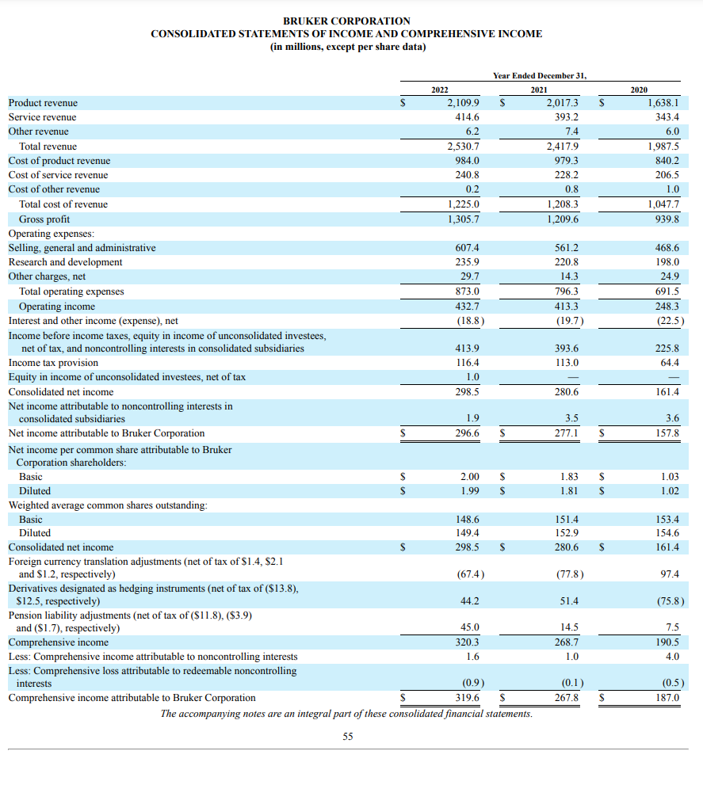 | 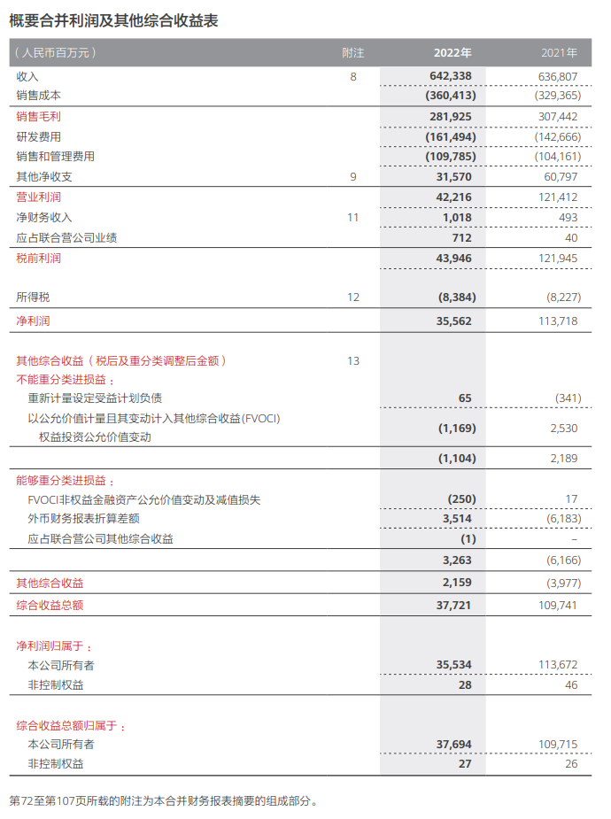 |
	  | 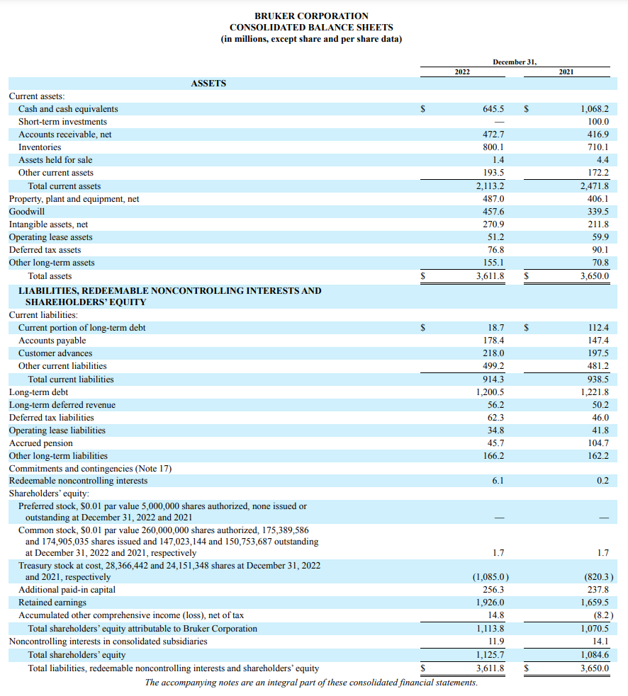 | 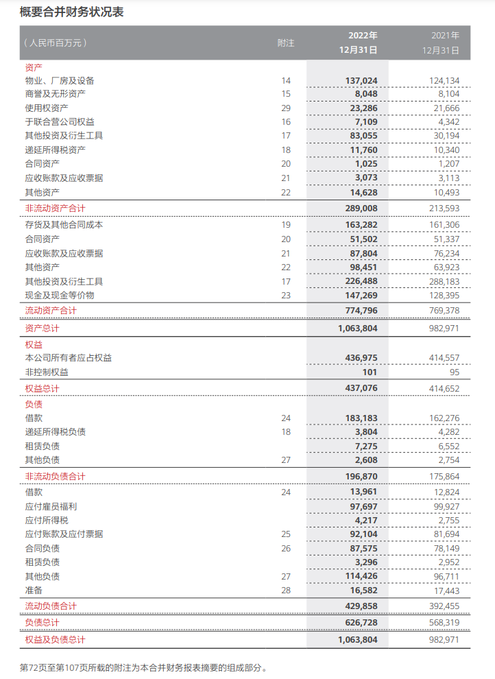 |
	  | 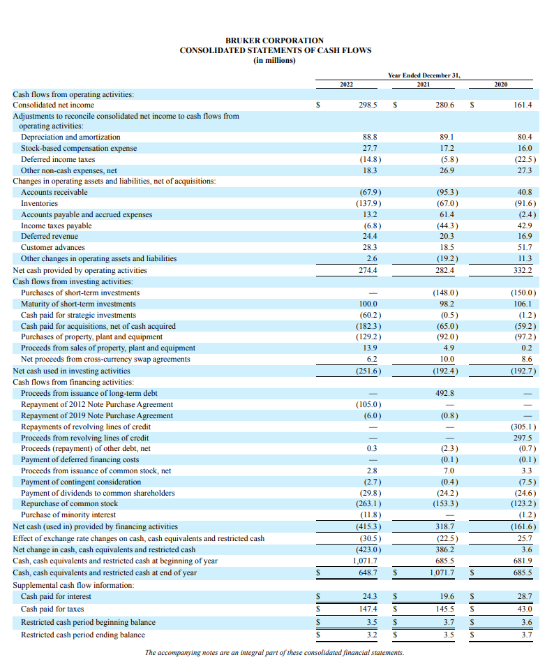 | 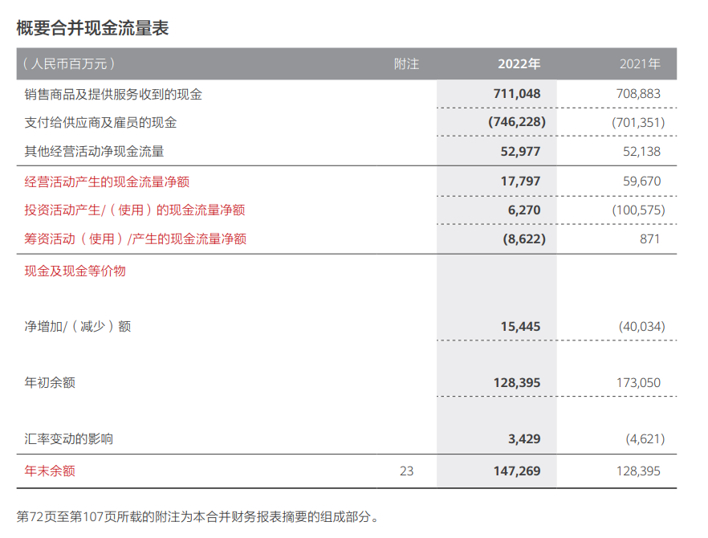 |
	- 推荐关注 —— [财务分析沈老师](https://space.bilibili.com/504556764)
- ## [[信息源]]
	- ### 年报
		- >通常位于：公司官网 - 投资者关系 (Investor Relations)
		- |[Bruker Corporation - IR Home](https://ir.bruker.com/ir-home/default.aspx)[:br][2022-Bruker-Annual-Report.pdf](https://s22.q4cdn.com/617463959/files/doc_financials/2022/ar/2022-Bruker-Annual-Report.pdf)|[债券投资者关系 - 华为](https://www.huawei.com/cn/bond-investor-relations)[:br][华为年报 - 华为](https://www.huawei.com/cn/annual-report)[华为2022年年度报告](https://www-file.huawei.com/minisite/media/annual_report/annual_report_2022_cn.pdf)|
		  |||
		  |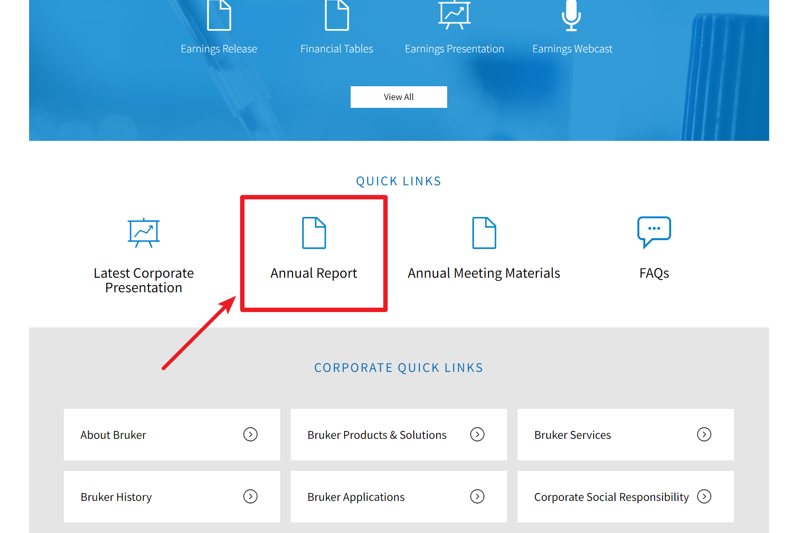| 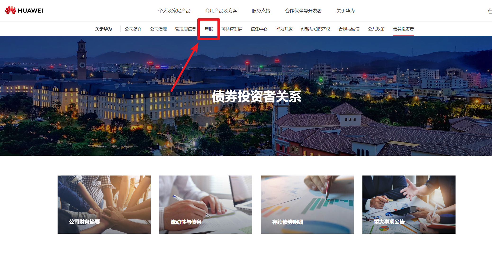 |
	- ### 研报 & 数据
		- [萝卜投研](https://robo.datayes.com/)（wind平替，金融行研&报告）
		- [行行查](https://www.hanghangcha.com)（wind平替，金融行研&报告）
		- [艾瑞咨询](https://www.iresearch.com.cn)
		- [东方财富](https://www.eastmoney.com)
	- ### 政府公开信息
		- [国家统计局](http://www.stats.gov.cn)
		- [发改委](https://www.ndrc.gov.cn/index.html)
		- [商务部](http://www.mofcom.gov.cn)
		- [财政部](http://www.mof.gov.cn/index.htm)
		- [工信部](https://www.miit.gov.cn)
		- [科技部](https://www.most.gov.cn/index.html)
	- ### 咨询
		- >Naja Wei: 四大的慎重，实习生复制粘贴报告。ADL可以看看）
		- [Arthur D. Little](https://www.adlittle.com/en)（工业咨询，包括咨询和产品设计）
		- [Frost & Sullivan](https://www.frost.com)
		- 四大
			- Mckinsey（麦肯锡）：https://www.mckinsey.com
			- Boston（波士顿）：https://www.bcg.com
			- Accenture（埃森哲）：https://www.accenture.com/us-en
			- RolandBerger（罗兰.贝格）：https://www.rolandberger.com/en/
	- 更多内容见 ((650083f9-9755-4423-a7a0-87b92328c81a))
- ## 工具
	- ### AI / 大语言模型
		- >善用 ChatGPT 类工具作为知识杠杆
		- |我是理工科，不懂[[财务报表]]怎么办？|我是文商科，不懂技术怎么办？|
		  | 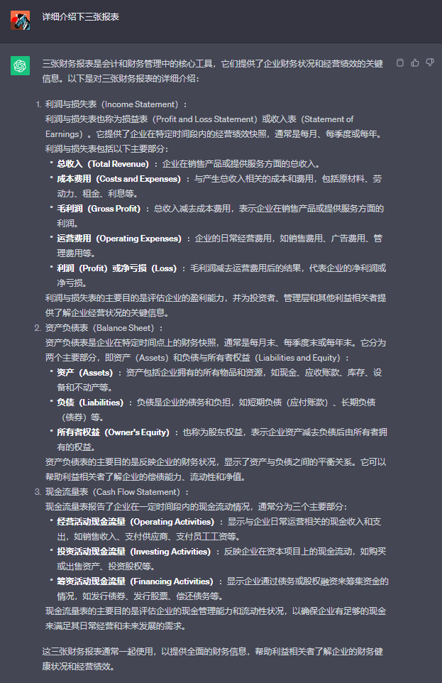{:height 538, :width 344} | 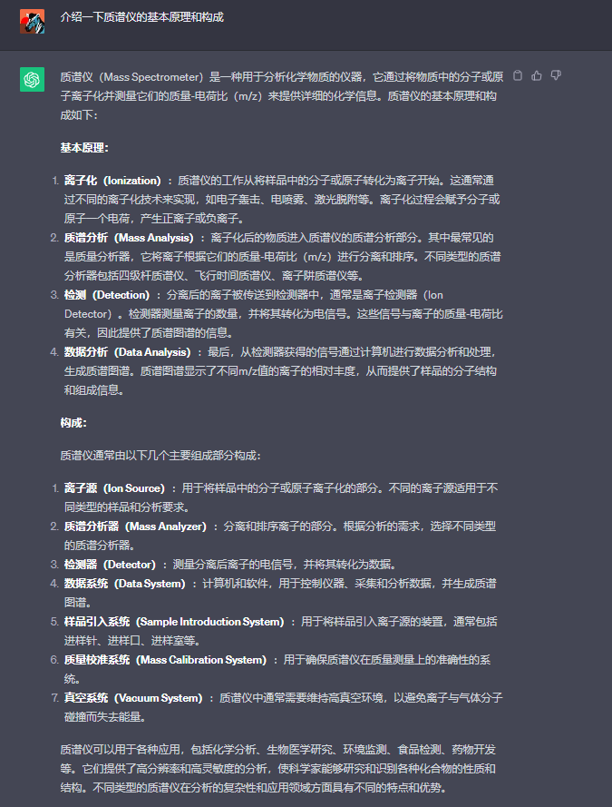 |
	- ### 协同工具
		- >推荐使用 **[飞书](https://www.feishu.cn/)** 作为团队协同知识库
		- 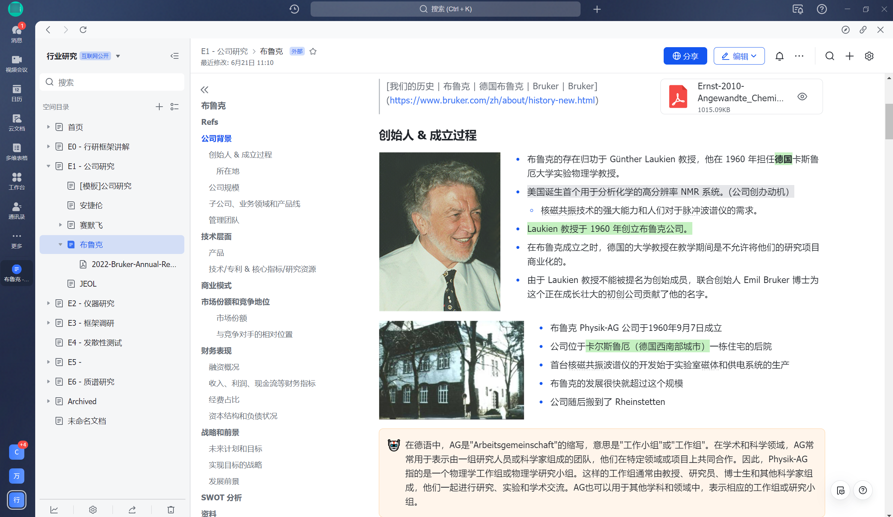
		- [飞书帮助中心 - 飞书使用技巧及常见问题解答](https://www.feishu.cn/hc/zh-CN/)
	- ### 调研与可视化
		- >可以尝试 Logseq，实现各类素材的整理与汇总
		- |[[质谱/白板]]|[[无液氦MRI]]|
		  | 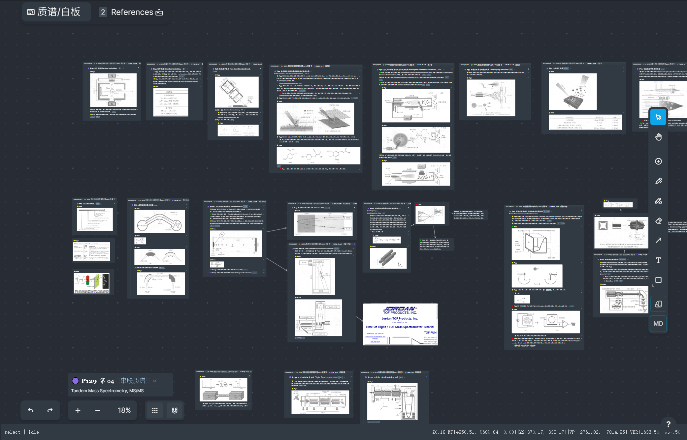|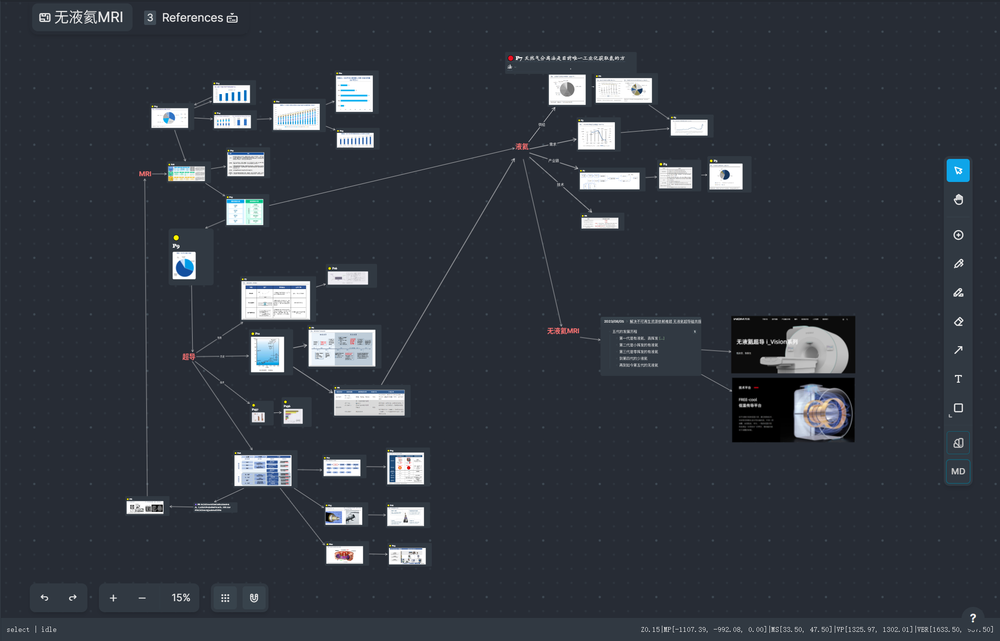|
- ## 行研思维
	- ### [快速了解行业: 研究渠道及方法](https://www.bilibili.com/video/BV1AF411T7eY/) #信息源
		- <iframe frameborder="no" framespacing="0" width="560" src="https://player.bilibili.com/player.html?bvid=BV1AF411T7eY&high_quality=1&autoplay=0" allow="accelerometer; clipboard-write; encrypted-media; gyroscope" allowfullscreen="" scrolling="no" border="0" height="360"></iframe>
	- ### [快速了解行业：常用框架](https://www.bilibili.com/video/BV1RB4y117mg/) #框架 #波特五力 #PEST #商业模式 #财务报表
		- <iframe frameborder="no" framespacing="0" width="560" src="https://player.bilibili.com/player.html?bvid=BV1RB4y117mg&high_quality=1&autoplay=0" allow="accelerometer; clipboard-write; encrypted-media; gyroscope" allowfullscreen="" scrolling="no" border="0" height="360"></iframe>
	- ### [一个小时调研全新领域，能了解到什么程度？](https://www.bilibili.com/video/BV16x4y1R7MH/)
- ## [[信息源]] plus
  id:: 650083f9-9755-4423-a7a0-87b92328c81a
  collapsed:: true
	- >由 Naja Wei 整理
	- ## 论文
		- 库
			- Web of Science：https://www.webofscience.com/wos/error
			- Google Scholar：https://scholar.google.com.hk/?hl=zh-CN
			- ScienceDirect：https://www.sciencedirect.com
		- 工具
			- Sci-Hub：https://sci-hub.se
			- Connected Papers（论文关系研究网站）：https://www.connectedpapers.com
		- 文献管理
			- Endnote
			- Mendeley
	- ## 数据
		- 公司数据
			- 企查查（国内公司数据）：https://www.qcc.com
			- Golden（全球公司查询）：https://golden.com
		- 数据
			- 萝卜投研（wind平替，金融行研&报告）：https://robo.datayes.com/
			- 行行查（wind平替，金融行研&报告）：https://www.hanghangcha.com
			- 慧博：http://www.hibor.com.cn
			- 艾瑞咨询：https://www.iresearch.com.cn
			- 东方财富：https://www.eastmoney.com
			- 大数据导航（综合黄页）：http://hao.199it.com
			- 数位观察：https://www.swguancha.com
			- 阿里研究院：http://www.aliresearch.com/cn/index
			- World Bank：https://data.worldbank.org/?iframe=true
		- 政府公开信息
			- 国家统计局：http://www.stats.gov.cn
			- 国家统计局_国家数据：https://data.stats.gov.cn/easyquery.htm?cn=C01&zb=A0A01&sj=2021
			- 发改委：https://www.ndrc.gov.cn/index.html
			- 商务部：http://www.mofcom.gov.cn
			- 财政部：http://www.mof.gov.cn/index.htm
			- 工信部：https://www.miit.gov.cn
			- 科技部：https://www.most.gov.cn/index.html
			- 生态环境部：https://www.mee.gov.cn
			- 自然资源部：https://www.mnr.gov.cn
			- 住建部：https://www.mnr.gov.cn
			- 交通运输部：https://www.mot.gov.cn
			- 水利部：http://www.mwr.gov.cn
			- 农业农村部：http://www.moa.gov.cn
		- 咨询（四大的慎重，实习生复制粘贴报告。ADL可以看看）
			- Arthur D. Little（工业咨询，包括咨询和产品设计）：https://www.adlittle.com/en
			- Frost & Sullivan：https://www.frost.com
			- Mckinsey（麦肯锡）：https://www.mckinsey.com
			- Boston（波士顿）：https://www.bcg.com
			- Accenture（埃森哲）：https://www.accenture.com/us-en
			- RolandBerger（罗兰.贝格）：https://www.rolandberger.com/en/
	- ## 法务
		- 专业律师提供
			- 中国法律服务网：https://ai.12348.gov.cn/pc/
			- 国家法律法规数据库：https://flk.npc.gov.cn
	- ## 标准&专利
		- 研究
			- 国自然基金：https://kd.nsfc.gov.cn
		- 专利
			- 中国专利：http://cpquery.cnipa.gov.cn
			- 知识产权局：https://www.cnipa.gov.cn/col/col1510/
			- Google Patents：https://patents.google.com
			- USPTO（美国）：https://uspto.report
	- ## 学习案例
		- 一级市场
			- 麦肯锡研究方法：https://www.bilibili.com/video/BV1t3411W7Ad/?spm_id_from=333.337.search-card.all.click&vd_source=83f96a02b58a44f666d70a22a172d099
		- 二级市场
			- 2021年中信证券行业研究方法培训：https://www.bilibili.com/video/BV1nL411j7S5?p=1&vd_source=83f96a02b58a44f666d70a22a172d099
- #+BEGIN_CENTER
  
  #+BEGIN_EXAMPLE
  Credit to NaJa Wei
  #+END_EXAMPLE 
  #+END_CENTER