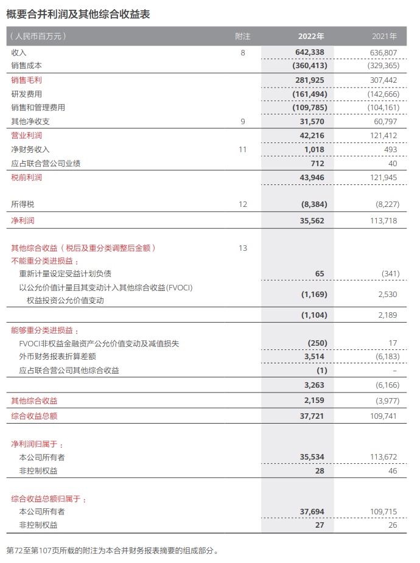
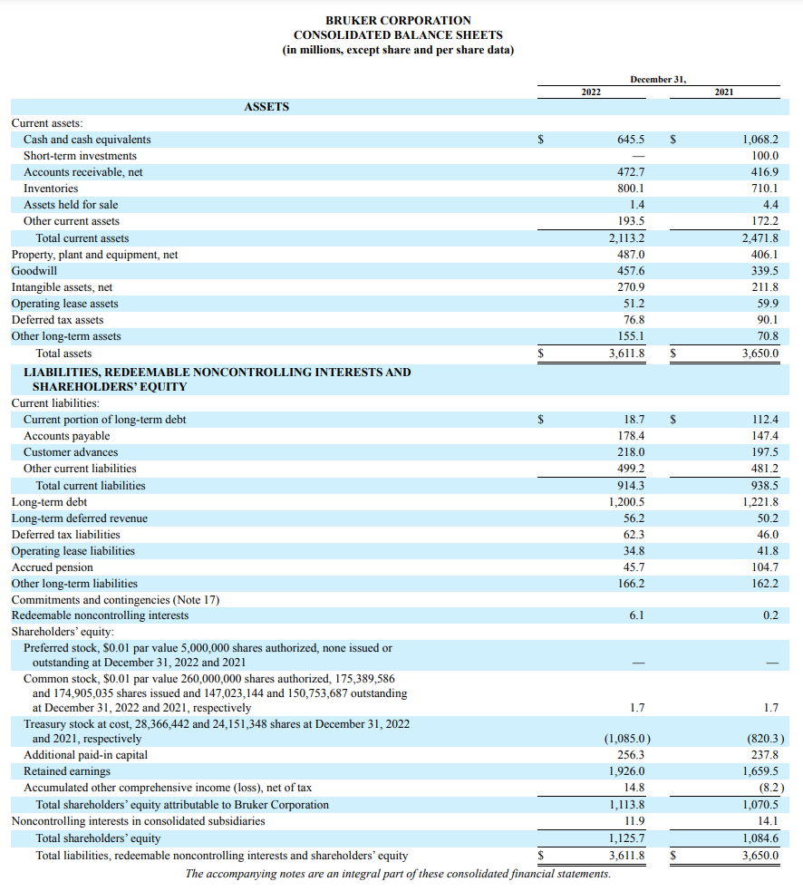
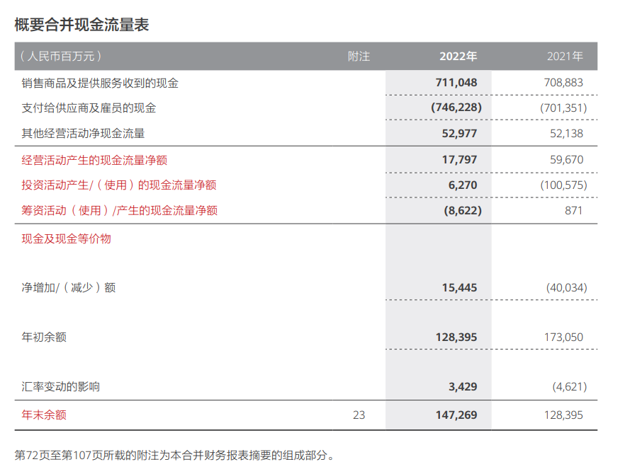

- >本页简要介绍最重要三个报表
- ### 损益表/利润表（Income Statement）
	- >损益表的主要目的是提供一个清晰的财务快照，以便利益相关者（如股东、投资者、管理层、债权人和审计师）了解企业在报告期内的经营情况和盈利能力。它还可以用于比较不同时间段内的业绩，分析成本和支出的趋势，以及制定战略决策，例如确定营销策略、降低成本或改进利润率。
	- 总收入（Total Revenue）
	- 成本与费用（Costs and Expenses）
	- 成本商品销售（Cost of Goods Sold，COGS）
		- 运营费用（Operating Expenses）
		- 利息费用（Interest Expenses）
		- 税收（Taxes）
	- 毛利润（Gross Profit）
		- 毛利润是总收入减去成本商品销售（COGS）后的金额。
		- 它代表了企业在销售产品或提供服务方面的毛利润。
	- 运营利润（Operating Profit）
		- 运营利润是扣除运营费用后的金额。
		- 它反映了企业在日常经营活动中的盈利能力，即销售和运营所产生的利润。
	- 净利润（Net Profit）
		- 净利润是扣除运营费用、利息费用和所得税后的最终金额。
		- 这是企业在特定时间段内的总利润，也称为净收益或净收入。
- ### 资产负债表（Balance Sheet）
	- >资产负债表的主要目的是提供一个企业在特定时间点上的财务快照，显示了资产、负债和所有者权益之间的平衡关系。它有助于了解企业的财务稳定性和偿付能力。资产负债表也可用于评估企业的资本结构、资产负债比率以及资产的流动性和价值。
	- 资产（Assets）
		- 流动资产（Current Assets）
			- 现金与现金等价物（Cash and Cash Equivalents）
			- 应收账款（Accounts Receivable）
			- 存货（Inventory）
			- 其他流动资产（Other Current Assets）
		- 非流动资产（Non-current Assets）
			- 不动产、厂房和设备（Property, Plant, and Equipment）
			- 投资（Investments）
			- 无形资产（Intangible Assets）
			- 其他非流动资产（Other Non-current Assets）
	- 负债与所有者权益（Liabilities and Equity）
		- 流动负债（Current Liabilities）
		  collapsed:: true
			- 应付账款（Accounts Payable）
			- 短期债务（Short-term Debt）
			- 其他流动负债（Other Current Liabilities）
		- 非流动负债（Non-current Liabilities）
		  collapsed:: true
			- 长期债务（Long-term Debt）
			- 非流动性负债（Non-current Liabilities）
		- 所有者权益（Equity）
		  collapsed:: true
			- 普通股（Common Stock）
			- 保留收益（Retained Earnings）
			- 其他权益项目（Other Equity Items）
- ### 现金流量表（Cash Flow Statement）
	- >现金流量表的主要目的是提供一个详细记录企业现金流动情况的报表，分析经营活动、投资活动和筹资活动对企业现金流的影响。它有助于了解企业的现金管理能力、流动性状况和资金来源。
	- 经营活动现金流量（Operating Activities）
		- 现金收入（Cash Inflows）
		  collapsed:: true
			- 销售产品或提供服务所获得的现金收入
			- 其他与主营业务相关的现金收入
		- 现金支出（Cash Outflows）
		  collapsed:: true
			- 采购商品和支付供应商
			- 支付员工工资和薪酬
			- 缴纳利息和税款
			- 其他与日常经营活动相关的现金支出
		- 经营活动净现金流（Net Cash Flow from Operating Activities）
		  collapsed:: true
			- 现金收入减去现金支出，反映了企业日常经营活动的现金流入与流出。
	- 投资活动现金流量（Investing Activities）
	  collapsed:: true
		- 现金收入（Cash Inflows）
			- 资产出售所获得的现金
			- 投资回报所带来的现金收入
		- 现金支出（Cash Outflows）
			- 购置资产和设备的现金支出
			- 投资支出
			- 其他与资本支出相关的现金支出
		- 投资活动净现金流（Net Cash Flow from Investing Activities）：现金收入减去现金支出，反映了企业的投资活动对现金流的影响。
	- 筹资活动现金流量（Financing Activities）
	  collapsed:: true
		- 现金收入（Cash Inflows）
			- 股权发行或股权回购所获得的现金
			- 债务发行所带来的现金
		- 现金支出（Cash Outflows）
			- 偿还债务的现金支出
			- 分配红利和支付利息的现金支出
			- 股权回购的现金支出
		- 筹资活动净现金流（Net Cash Flow from Financing Activities）：现金收入减去现金支出，反映了企业筹资活动对现金流的影响。
	- 现金变动（Net Change in Cash）
	- 期初现金余额（Beginning Cash Balance）
	- 期末现金余额（Ending Cash Balance）
- >来看看真实的例子！
- |[2022-Bruker-Annual-Report.pdf](https://s22.q4cdn.com/617463959/files/doc_financials/2022/ar/2022-Bruker-Annual-Report.pdf)|[华为2022年年度报告](https://www-file.huawei.com/minisite/media/annual_report/annual_report_2022_cn.pdf)|
  |  |  |
  |  |  |
  |  |  |
- ## 推荐关注 —— [财务分析沈老师](https://space.bilibili.com/504556764)
-